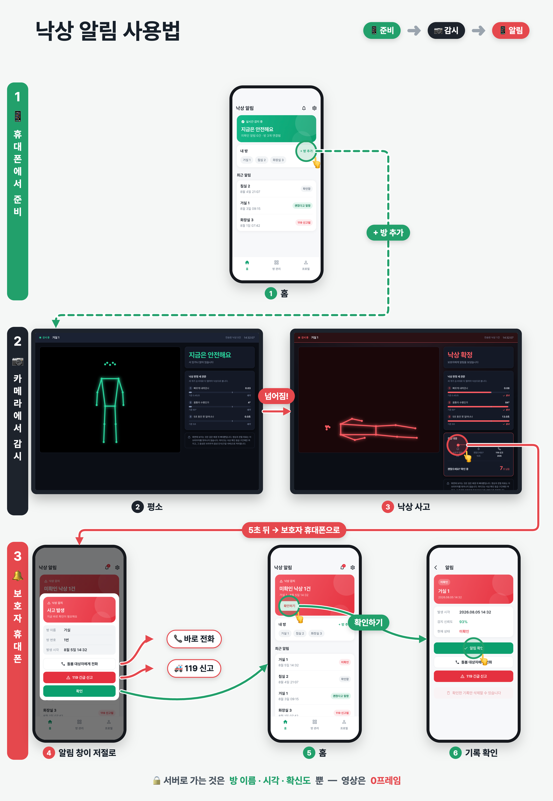
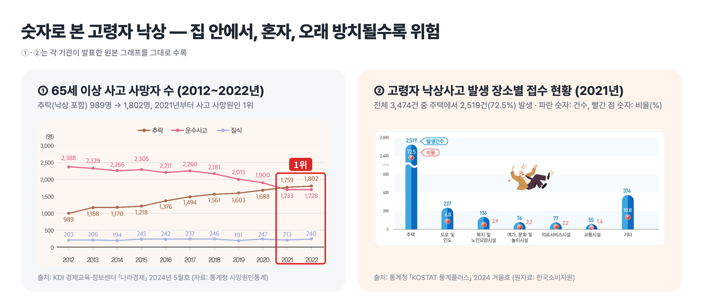
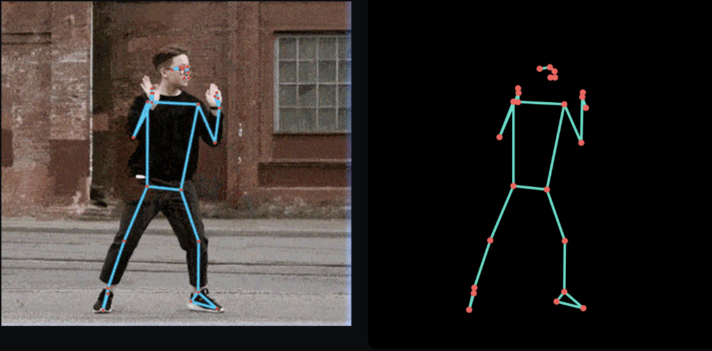
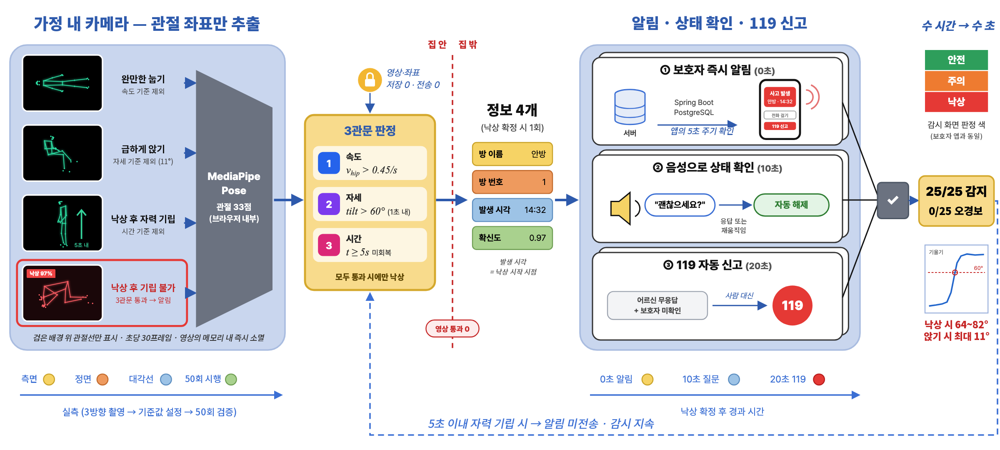
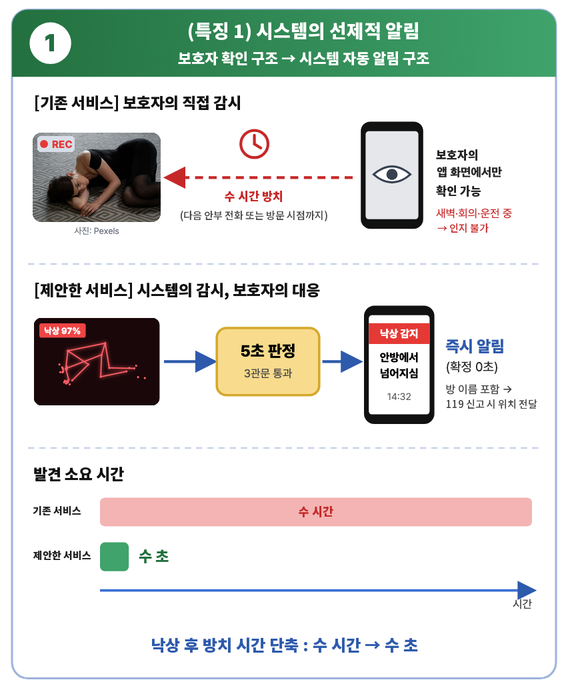
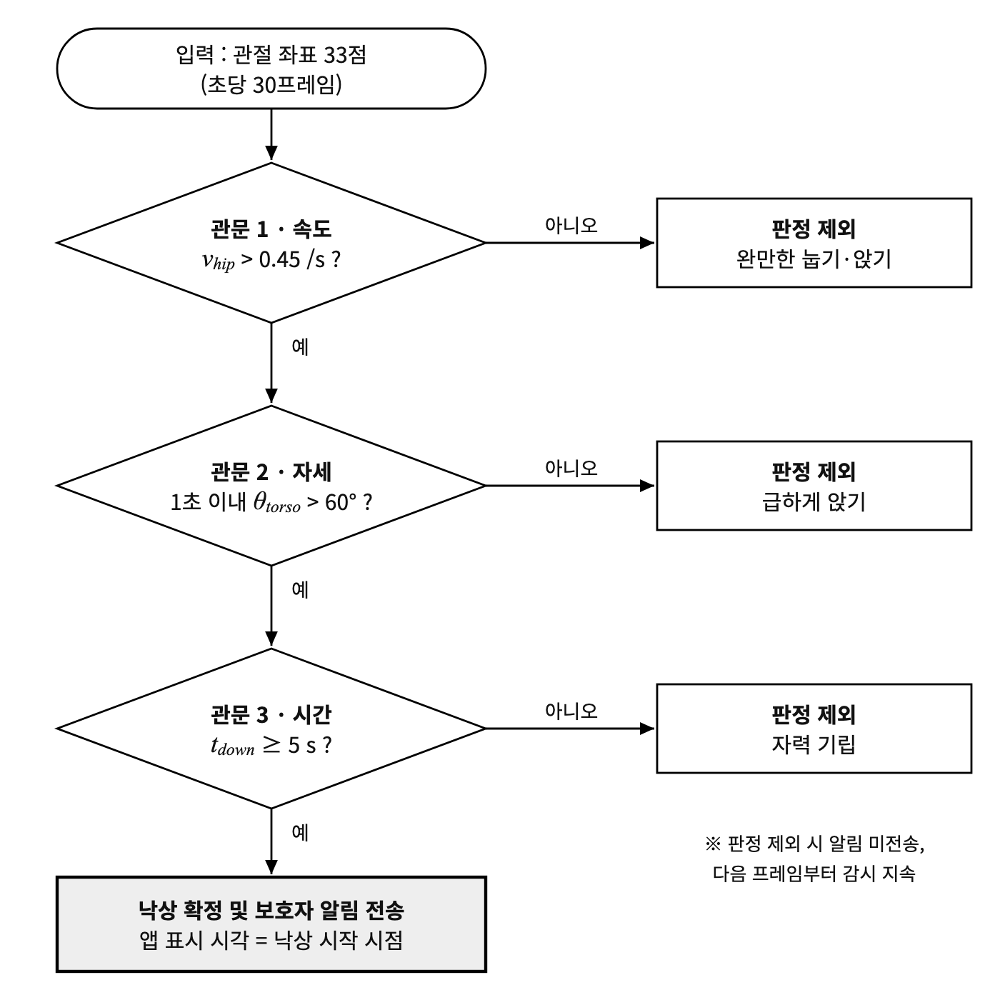
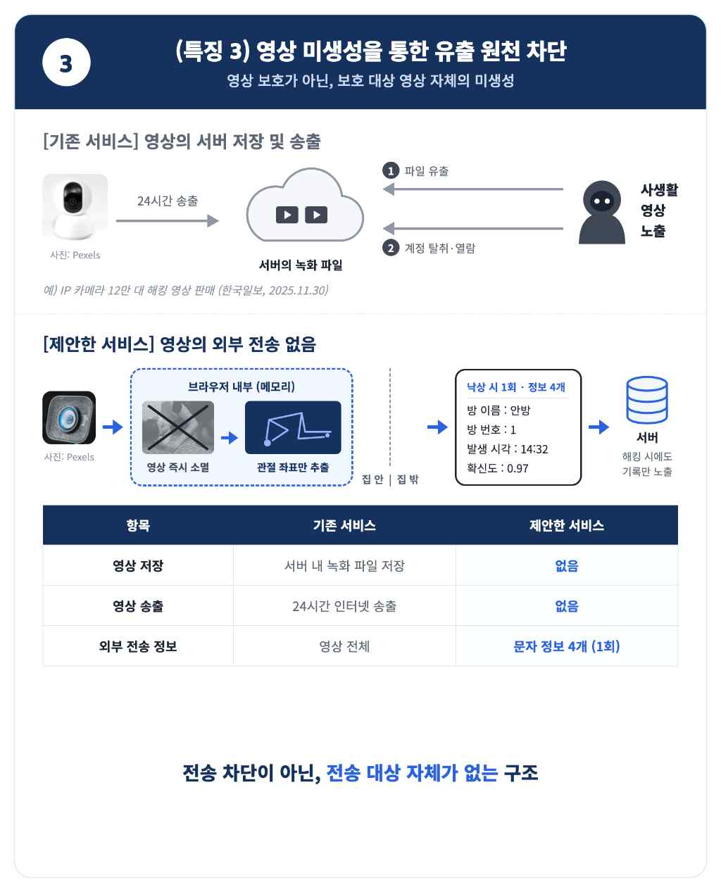
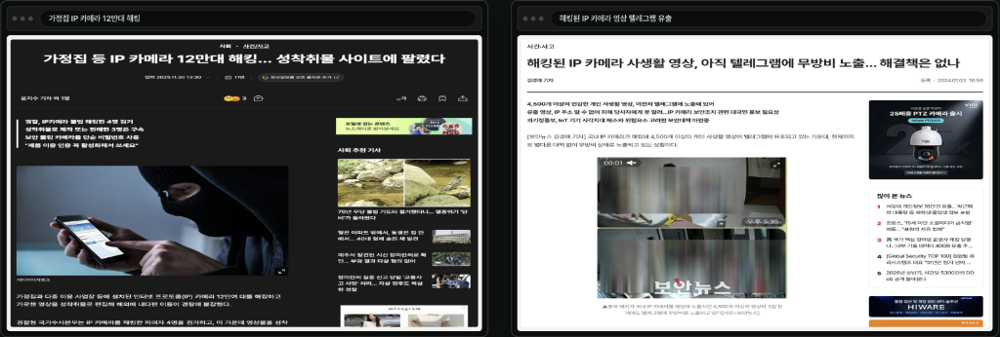

프라이버시 보존형 노인 낙상 감지 시스템 — Fall Guardian

독거노인을 위한 자세 인식 AI 기반 낙상 감지 및 보호자 알림 시스템 개발

공모전 제출 보고서 (제3회 미래융합인재 발굴 소프트웨어 챌린지 · 팀 지수와 조카들)

&lt;그림 6&gt; 낙상 알림 사용법 — 휴대폰에서 방 추가 → 카메라로 감시 → 낙상 시 보호자 휴대폰으로 알림

---

## 1. 참가 동기, 활동 배경

### 1) 개발 동기 : 독거 조모의 화장실 낙상 사고

- 화장실에서 미끄러져 낙상한 후 자력으로 기립하지 못한 채 장시간 방치되었으며, 우연히 방문한 부친에 의해 발견되어 응급실로 이송
- 방문·전화 확인 간의 공백 : 저녁 통화 불통 시 다음 날 아침 통화 전까지 안부 확인 수단 부재
- 가정용 카메라(홈캠) 설치를 수차례 검토하였으나 모두 무산
  - [공백 문제] 가족의 24시간 화면 확인이 불가능하여 수면·근무 시간대의 사각 지대 발생

### 2) 문제의 사회적 규모

- **낙상은 고령자 사고 사망 원인 1위이며, 핵심 위험 요인은 낙상 후 장시간 방치**
  - 낙상은 2021년 이후 고령자 사고 사망 원인 1위를 차지
  - 65세 이상 추락 사망자 수는 2012년 989명에서 2022년 1,802명으로 10년간 약 2배 증가 [KDI 경제정보센터, 2024]
  - 고령자 낙상사고의 72.5%(2021년, 3,474건 중 2,519건)가 주택 안에서 발생 [통계청 「통계플러스」 2024 겨울호]
  - 응급 호출기를 보유한 90세 이상 노인의 단독 낙상 141건 중 113건(80%)에서 호출기 미사용, 1시간 이상 방치된 38건 중 37건에서도 미사용 [Fleming &amp; Brayne, BMJ, 2008]
  - 장시간 방치 시 사망 위험이 약 2배 증가하고 폐렴·욕창·탈수 등의 합병증 유발 [Bloch, J. Am. Geriatr. Soc., 2012]
    - [시사점] 감지 이후 조치까지의 소요 시간이 문제의 본질

&lt;그림 1&gt; 숫자로 본 고령자 낙상 (출처: KDI, 통계청)

### 3) 기존 해결책의 한계

- **비용 부담이 크거나, 사고를 뒤늦게 알거나, 정작 위급할 때 쓸 수 없어 현실에서 사용하기에 거리감 존재**
  - 정부에서 보급하는 응급안전안심서비스는 '장시간 무활동' 상태를 통해 사후 인지
  - **응급 호출기는 의식 소실 시 사용 불가**하며, 실제 보유자의 80%가 낙상 시 미사용
  - 레이더 센서는 **방당 30\~90만 원**(판매가), 응급 호출기는 기기값 외에 관제 서비스 **월 5\~8만 원의 지속 비용** 발생

### 4) 해결 착안점

- **기기 내 자세 인식 AI의 등장**
  - Google의 공개 자세 인식 모델(MediaPipe Pose) 활용 시 기기 내부에서 인체 관절 33개 지점의 위치 추출 가능 [사진 1(a)]
  - 영상은 기기 내부에서 관절 좌표로 변환된 직후 폐기되며, 외부로는 판정 결과(텍스트)만 전송 [사진 1(b)]
  - 최종 목표 : 개인정보 유출 없이 보호자의 낙상 인지 시점을 수 시간 후에서 **수 초 이내**로 단축

(a) 영상 위 관절 33개 추출　　(b) 영상 없이 남은 관절 좌표

&lt;사진 1&gt; MediaPipe Pose (출처: LearnOpenCV)

---

## 2. 주요기능과 특징, 기대효과

&lt;그림 2&gt; 제안한 서비스 전체 개요

### 1) 시스템 개요

- **낙상사고 발생 시 보호자에게 신속히 통보**
  - 전송 항목 : 방 이름 · 방 번호 · 발생 시각 · 확신도 (외부로 전송되는 영상은 0프레임)
  - 시스템 구성 : 3개 모듈
    - [고령자 거주 공간] 관절 33개 지점을 추출한 후 움직임 정보만으로 낙상을 판정하며, 영상과 관절 좌표는 모두 기기 내부에서 처리 후 폐기
    - [서버] 낙상 확정 시 텍스트 기록 1건만 수신하며, 영상 수신 경로 자체가 존재하지 않는 구조
    - [보호자 앱] 신규 낙상 기록 수신 시 '사고 발생 창'을 표시하고 알림 발송

### 2) 주요 기능

- **3단계 판정 기반 실시간 낙상 감지**
  - 관절 33개 지점의 정보를 바탕으로 속도·자세·시간의 3단계 조건을 모두 충족하는 경우에만 낙상으로 판정 (세부 내용은 특징 2 참조)
- **보호자 즉시 알림**
  - 낙상 확정 시 보호자 스마트폰에 '사고 발생 창'이 표시되며, 보호자의 확인 전까지 창 유지
  - 해당 창에서 고령자 및 119와의 즉시 전화 연결 가능
- **무응답 시 119 자동 신고**
  - **회의·운전·수면 등으로 보호자가 알림을 확인하지 못하는 상황에 대비**
  - 낙상 확정 후 시스템이 '고령자의 움직임 재개 여부'와 '"괜찮으세요?"라는 음성 질문에 대한 응답 여부'를 지속적으로 확인
  - 두 항목 중 하나 이상 확인 시 상황이 사람에게 인계된 것으로 판단하여 자동 신고 절차 해제
  - **낙상 확정 후 20초 경과 시점까지 고령자 무응답 및 보호자 미확인 시 119 자동 신고**

&lt;표 1&gt; 낙상 확정 이후 응급 대응 타임라인

| 시각    | 동작                                     |
| ----- | -------------------------------------- |
| 0초    | 낙상 확정 및 보호자 스마트폰으로 전송                  |
| 10초   | 스피커를 통해 "괜찮으세요?" 음성 질문 출력              |
| \~20초 | "괜찮아" 응답 시 해제 및 앱에 '괜찮다고 말함' 표시        |
| 20초   | 무응답·미확인 시 119 신고 기록 및 앱에 신고 배지 표시      |

### 3) 특징 1 : 시스템의 선제적 알림 구조

&lt;그림 3&gt; 특징 1 — 시스템의 선제적 알림 구조

- **'보호자의 직접 감시 구조'에서 '시스템의 감시, 보호자의 대응 구조'로 전환**
  - 기존 서비스 : 녹화 장치에 해당하며, **보호자의 앱 화면에서만 안전 여부 확인 가능**
    - 새벽·회의·운전 중 사고 발생 시 보호자의 다음 스마트폰 확인 시점까지 인지 불가
  - 제안한 서비스 : **판단은 시스템이 수행**하며, 보호자는 평상시 별도의 조치 없이 실제 사고 발생 시에만 알림 수신
  - **발견 소요 시간 단축** : MediaPipe가 낙상사고를 감지하여 수 초 이내 알림
    - 실질적 위험 요인인 낙상 후 방치 시간의 직접적 단축
  - 알림에 발생 위치(방 이름) 포함 → 119 신고 시 위치 즉시 전달 가능

### 4) 특징 2 : 3단계 낙상 판정을 통한 낙상과 일상적 눕기 동작의 구분

&lt;그림 4&gt; 특징 2 — 3단계 낙상 판정을 통한 낙상과 일상적 눕기 동작의 구분

- **낙상 감지의 핵심 과제는 일상 동작을 낙상으로 오판하지 않는 것**
  - '신체가 수평이면 낙상'과 같은 단순 기준 적용 시 침대에 눕거나 바닥에 앉는 동작까지 낙상으로 판정되어 오경보 반복 → 보호자의 알림 무시 초래
  - 세 단계를 순서대로 모두 통과한 경우에만 낙상으로 판정
    - 단계 1 : 엉덩이 하강 속도의 초당 0.45(화면 높이 대비 비율) 초과 여부 확인 → 완만하게 눕거나 앉는 동작 제외
    - 단계 2 : 1초 이내 몸통의 60° 초과 기울어짐 여부 확인 → 몸통이 직립 상태로 유지되는 빠르게 앉는 동작 제외
    - 단계 3 : 5초간 기립 불가 여부 확인 → 자력으로 기립한 경우 알림 미전송
  - 단계 3의 의의 : 일시적 낙상 후 즉시 기립한 경우의 불필요한 알림 차단 — 필요한 경우에만 알림을 발송하여 알림 신뢰도 유지
  - 보호자 앱 표시 시각 : 판정 완료 시점이 아닌 **낙상 시작 시점**

### 5) 특징 3 : 영상 미생성을 통한 유출 원천 차단

&lt;그림 5&gt; 특징 3 — 영상 미생성을 통한 유출 원천 차단

- **영상 보호가 아닌, 보호 대상 영상 자체의 미생성**
  - 기존 서비스의 유출 지점 2곳 : 서버에 저장된 녹화 파일의 유출, 계정 탈취를 통한 실시간·과거 영상 열람
  - 가정용 홈캠 영상의 유출 및 거래 사건 보도 지속

&lt;사진 2&gt; IP 카메라 해킹 관련 보도 (출처: 한국일보 2025.11.30., 보안뉴스 2024.01.03.)

- 제안한 서비스는 위 두 유출 지점이 모두 존재하지 않는 구조

&lt;표 2&gt; 기존 서비스 대비 데이터 처리 비교

| 항목            | 기존 서비스               | 제안한 서비스                         |
| ------------- | -------------------- | ------------------------------- |
| 영상 저장         | 서버 내 녹화 파일 저장        | **미저장**                         |
| 영상 송출         | 24시간 인터넷 송출          | **미송출**                         |
| 화면 표시         | 얼굴·옷차림·실내 모습을 그대로 표시 | 검은 배경 위에 관절선만 표시                |
| 관절 좌표         | 없음                   | 외부 미전송                          |
| 외부 전송 정보      | 영상 전체                | 낙상 확정 시 1회, 방 이름·방 번호·발생 시각·확신도 |
| 서버 해킹 시 노출 정보 | 개인정보가 담긴 영상          | "○시 ○분, 안방에서 낙상" 수준의 기록에 한정     |

- 전송 차단이 아닌, **전송 대상 자체가 없는** 구조
  - 영상은 기기 내부 메모리에서 관절 좌표로 변환된 즉시 폐기, 서버 측에는 영상 수신 경로가 부재
  - 개인정보 노출에 대한 사용자의 수용을 전제하는 방식에서, 잔존 데이터의 부재를 근거로 **안전성을 입증**하는 방식으로 전환

### 6) 평가

**&lt;표 3&gt; 성능 평가 결과 (핵심 성과)**

> **미감지 낙상 0건 · 오경보 0건 · 약 5초 이내 보호자 알림 · 외부 전송 영상 0프레임**

| 성능지표                 | 정의                                      | 측정 방법                                                 | 기존 수준                                | **제안한 서비스 결과**                                           |
| -------------------- | --------------------------------------- | ----------------------------------------------------- | ------------------------------------ | -------------------------------------------------------- |
| 관절 위치 인식 정확도 (PCK@0.2) | 예측 관절 위치와 실제 위치 간 오차가 몸통 크기의 20% 이내인 비율 | 구글 공식 검증 (요가·댄스·HIIT 영상, 카메라 2\~4m 거리 1인, 관절 17개 기준)  | Apple Vision : 82.7\~91.4%           | **90.2\~93.5% (MediaPipe Pose Lite 모델)**                 |
| 처리 속도                | 프레임 1장의 관절 위치 추출 소요 시간                  | 구글 공식 측정 (Pixel 3 휴대폰 GPU · MacBook Pro 15″ 2017 노트북) | 고정밀(Heavy) 모델 : 38\~53ms             | **20\~25ms, 초당 약 40\~50프레임 처리 (MediaPipe Pose Lite 모델)** |
| 낙상 판정 정확도            | 낙상과 일상 동작의 정확한 구분 비율                    | 낙상 25회, 눕기·앉기·서 있기 25회 등 총 50회 시행                     | 기존 서비스 : 낙상 자동 판정 없음 (보호자의 영상 직접 확인) | **50/50 (100%)**                                         |
| 오탐지(오경보)             | 낙상이 아닌 동작을 낙상으로 판정한 횟수                  | 눕기·앉기·서 있기 동작 25회 시행                                  | 스마트워치 자동 신고의 84%가 오신고                | **0/25 (0%), 오경보 0건**                                    |
| 발견 소요 시간             | 낙상 후 보호자 인지까지의 소요 시간                    | 낙상 확정 후 보호자 앱 알림 도착 시간 측정                             | 다음 안부 전화 또는 방문 시점까지 수 시간             | **약 5초, 판정 직후 전송**                                       |
| 외부 전송 영상             | 외부로 전송되는 영상 프레임 수                       | 서버 수신 데이터 확인                                          | 기존 서비스 : 24시간 영상 송출                  | **0프레임, 텍스트 4개 항목 1회 전송**                                |

(관절 위치 인식 정확도·처리 속도 출처: Google MediaPipe Pose 공식 문서 'Pose Estimation Quality' / 스마트워치 오신고 비율 출처: 경남소방본부 2023년 통계, 문화일보 2024.02.15.)

### 7) 기대효과

- **전용 장비 불필요, 월 이용료 없는 경제적 도입**
  - 기존 홈캠은 **특정 제조사의 기기와 해당 회사의 앱·저장 서비스에 종속**되는 반면, 제안한 서비스는 **제조사와 무관하게 일반 웹캠 또는 기존 카메라로 동작**
  - 스마트워치(판매가 25\~50만 원), 레이더 센서(판매가 방당 30\~90만 원) 등 전용 장비의 신규 구매 불필요
  - 영상 대신 텍스트 4개 항목만 전송하므로 영상 저장 서버 및 관제 인력이 불필요하며, 응급 호출기 관제 서비스(월 5\~8만 원)와 같은 월 이용료 미발생

&lt;표 4&gt; 기존 서비스 대비 도입 비용 비교 (원가 기준)

| 구분              | 기기 원가 (단위: 만 원)     | 월 운영비 (단위: 만 원)         | 비고                                         |
| --------------- | ------------------- | ----------------------- | ------------------------------------------ |
| 스마트워치           | 12\~19 (부품·조립 원가)   | 없음 (휴대폰 연동)             | 1인 1대 전용 기기, 매일 충전 필요                      |
| 응급 호출기(목걸이형 버튼) | 11\~13 (공장 출고가)     | 약 5 (관제센터 위탁 관제료)       | 상담원이 24시간 대기하는 관제센터 운영비 지속 발생              |
| 정부 응급안전안심서비스    | 약 94 (가구당 장비 5종·설치) | 공개 자료 없음 (지역센터 인력·통신비)  | 낙상 전용 센서가 없어 '장시간 무활동' 상태를 통해 사후 인지        |
| 가정용 홈캠          | 4\~6 (제조 원가)        | 약 0.6 (24시간 영상 클라우드 저장) | 영상 저장 용량에 비례해 서버 비용 증가                     |
| 레이더 센서          | 방당 약 7 (낙상 감지 모듈)   | 공개 자료 없음                | 방별 전용 장비 신규 구매 필요                          |
| **제안한 서비스**     | **1\~3 (일반 웹캠)**    | **약 0.1\~0.3 (기기 전기료)** | **제조사 무관하게 일반 카메라에서 동작, 기존 여분 카메라 활용 시 0원** |

(환산 기준 1달러 = 1,400원. 스마트워치: IHS Apple Watch 1세대 분해 분석 83.7달러, Counterpoint Apple Watch Series 6 분석 136달러 / 응급 호출기: Global Sources 4G LTE 낙상·SOS 펜던트 제조사 출고가 78\~96달러, 관제료: Liberty Medical Response 판매점 대상 월 34.95달러 / 정부 서비스: 보건복지부 2026.4.1. 보도자료, 노후 장비 약 9만 대 교체 예산 846억 원을 대수로 나눈 값 / 홈캠: Wyze Cam Pan 제조 원가 30.03달러, TI IP카메라 레퍼런스 설계 부품비 40달러 미만, 운영비는 AWS Kinesis Video Streams 요금(수신 GB당 0.0085달러, 보관 GB·월당 0.023달러)으로 720p 1Mbps 영상을 7일간 보관할 때를 계산한 추정치 / 레이더: Seeed Studio MR60FDA2 60GHz 낙상 감지 모듈 키트 53달러 / 제안한 서비스: 노트북 소비전력 15\~30W로 24시간 가동 가정, 한전 주택용 저압 1단계 kWh당 120원, 서버는 AWS Lightsail 최소 사양 월 5달러)

- **발견 소요 시간 단축**
  - 장시간 방치에 따른 위험(사망 위험 약 2배, 폐렴·욕창·탈수)의 직접적 감소
  - 해외 요양시설 연구에서 유사한 카메라 기반 감지 시스템 도입 후 바닥 체류 시간이 평균 29.6분 단축되고, 1시간 이상 방치 비율이 31%에서 0%로 감소한 사례 보고 [Bayen et al., JMIR, 2021]
- **개인정보를 침해하지 않는 안전 확보**
  - 영상을 생성하지 않는 구조를 통해 안전과 개인정보 보호 중 하나를 포기해야 하는 상충 관계 해소
  - 고령자의 피감시 부담 없는 24시간 보호 및 보호자의 영상 유출 우려 해소
- **보호자의 일상 회복**
  - '매일 안부 전화 → 미응답 시 불안 → 주말 확인 방문'으로 이어지는 반복적 부담 경감
    - '알림 없음 = 이상 없음'의 성립으로 보호자의 걱정이 상시 감시 노동으로 전환되는 문제 방지
- **착용·조작 불필요에 따른 실질적 보호**
  - 고령자의 별도 기기 착용·버튼 조작 불필요
  - 미착용·배터리 방전·의식 소실로 인한 작동 불능 상황의 구조적 차단 (기존 방식의 주요 실패 요인 해소)
- **오경보 최소화를 통한 알림 신뢰성 확보**
  - 스마트워치 자동 신고의 84%가 오신고[경남소방본부, 2023]인 것과 달리, 3단계 판정을 통해 눕기·앉기 동작을 낙상 판정에서 배제
    - 잦은 오경보는 사용자의 알림 차단으로 이어져 시스템을 무력화하므로, 오경보 감소는 편의 요소가 아닌 시스템 존립의 필수 조건

---

## 3. 사용법

&lt;그림 6&gt; 낙상 알림 사용법 — 휴대폰에서 방 추가 → 카메라로 감시 → 낙상 시 보호자 휴대폰으로 알림
